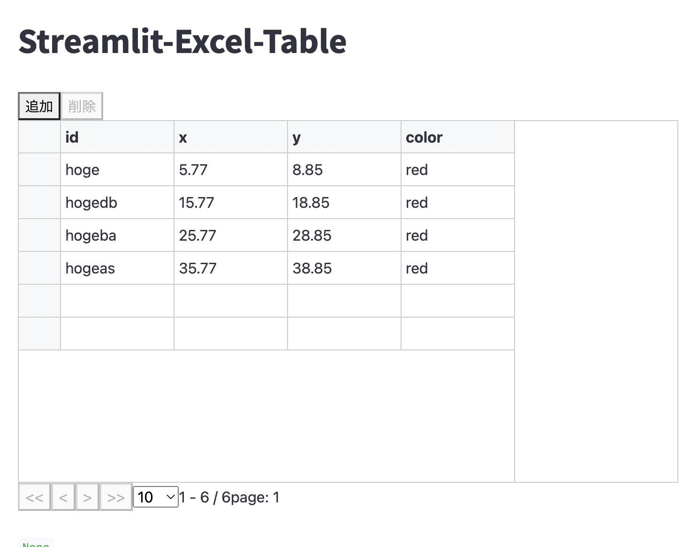

# Streamlit-Excel-Table

This Streamlit component is a wrapper component of [@tk42/react-awesome-table](https://github.com/tk42/react-awesome-table).

```react-awesome-table``` is a great table module like Microsoft Excel for web frontend. More information in [Kazunori-Kimura/react-awesome-table](https://github.com/Kazunori-Kimura/react-awesome-table) (Thanks!)

## Install
```
pip install streamlit-excel-table
```

## Overview

Streamlit-Excel-Table is a Streamlit component like Microsoft Excel.

```python
import streamlit as st
from st_excel_table import Table

st.title("Streamlit-Excel-Table")

data = [
    {"id": "hoge", "x": 5.77, "y": 8.85, "color": "red"},
    {"id": "hogedb", "x": 15.77, "y": 18.85, "color": "red"},
    {"id": "hogeba", "x": 25.77, "y": 28.85, "color": "red"},
    {"id": "hogeas", "x": 35.77, "y": 38.85, "color": "red"},
]

columns = [
    {"name": "id"},
    {"name": "x"},
    {"name": "y"},
    {"name": "color"},
]

Table(data, columns)
```

